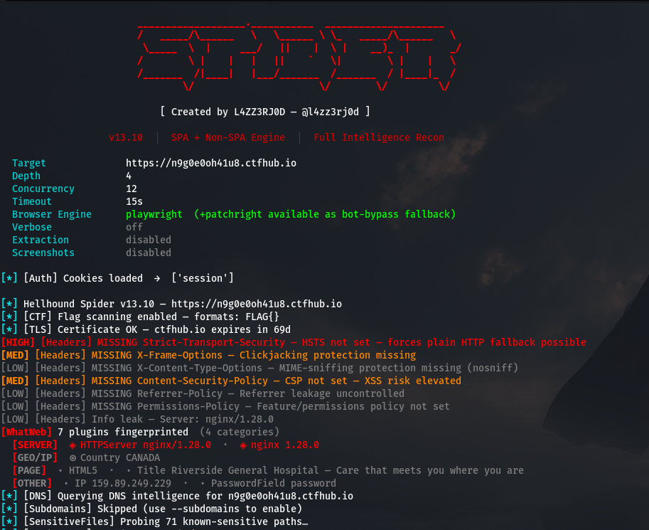
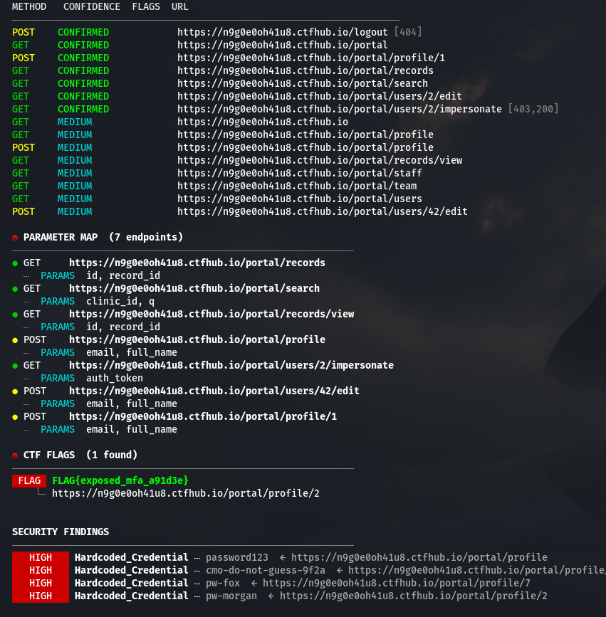
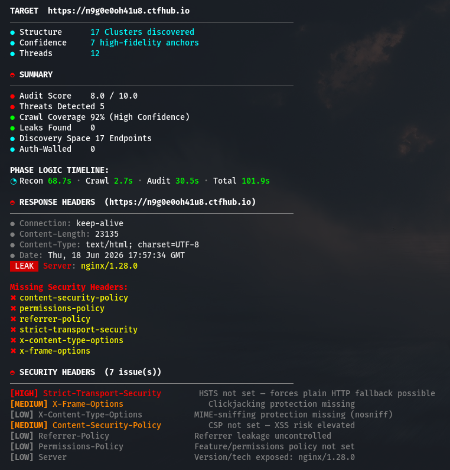

<p align="center">
  
</p>

<h1 align="center">Hellhound Spider</h1>

<p align="center">
  Fully autonomous web crawler for security testing — maps endpoints, parameters, and security issues across traditional and SPA web applications. Drop a URL. Walk away.
</p>

<p align="center">
  
  
  
  
</p>

---

## What It Does

Hellhound Spider crawls a web application and produces a complete map of every endpoint, parameter, and security surface it can reach. The output is a structured JSON report — sorted by confidence, with parameters grouped by source, ready to feed directly into attack agents or import into Burp Suite.

It runs two crawl engines in parallel: async HTTP workers for speed, and headless Chromium for JavaScript-heavy SPAs. For SPAs it intercepts live XHR and fetch calls as the browser actually makes them — including POST body parameters and response IDs. When the crawl finishes, it classifies every endpoint automatically so downstream agents start with context, not cold discovery.

---

## Installation

### Linux / macOS

```bash
git clone https://github.com/project-hellhound-org/hellhound-spider.git
cd hellhound-spider
chmod +x install.sh
./install.sh
```

The installer creates an isolated virtual environment (`.venv`) and a system-wide `spider` wrapper:

```bash
spider https://target.com
```

A man page is also installed — run `man spider` for the full reference.

### Windows

```bash
git clone https://github.com/project-hellhound-org/hellhound-spider.git
cd hellhound-spider
pip install -e .                    # core install
pip install -e ".[spa]"             # with Playwright SPA support
playwright install chromium
```

### Uninstall

```bash
./uninstall.sh           # Linux / macOS
pip uninstall hellhound-spider   # Windows
```

---

## v13.10 — Recon Overhaul

v13.10 restructures the reconnaissance pipeline for precision and operator control — subdomain enumeration is now opt-in, a new wordlist brute-force engine ships with soft-404 filtering, and the unreliable injection-candidate scoring heuristic has been removed entirely.

### New in v13.10

- **No-Crawl Mode** (`--no-crawl` / `-N`) — Run only the recon and probing modules (robots, sitemap, admin panels, sensitive files, wordlist, subdomains, Wayback) without BFS link crawling. Useful for fast, targeted reconnaissance.
- **Wordlist Brute Force** (`--wordlist FILE`) — Directory and file discovery using a user-supplied wordlist. Responses are filtered through the same canary-fingerprint and soft-404 logic used by the sensitive-file probe, so noisy SPA/wildcard-200 targets don't flood results.
- **Opt-in Subdomain Enumeration** (`--subdomains`) — Certificate transparency subdomain enumeration is now opt-in instead of running by default, reducing scan noise on targets where subdomains are out of scope.
- **WhatWeb Technology Analysis** — Automatically integrates WhatWeb (runs concurrently with TLS checks) to identify and categorize the server runtime, CMS, frameworks, JS libraries, CDNs, and cookies. Visualized using a rich, color-coded badge category system.
- **Bot-Bypass Browser Engine** — Leverages Playwright for standard SPA analysis and automatically falls back to Patchright for stealthy bot-bypass when meeting Cloudflare or other WAF challenges.
- **CTF Flag Mining** (`--ctf-flag TEMPLATE` / `-K`) — Auto-scans all processed pages, JavaScript files, CSS comments, HTML data attributes, API responses, and error page traces for custom flag templates. Use `{}` as a wildcard body placeholder.

---

## Interface Preview

<p align="center">
  
</p>

<p align="center">
  
</p>

<p align="center">
  
</p>

---

## Automated Evidence Collection

The spider can automatically capture screenshots of high-value targets (admin panels, login pages, API documentation) during the crawl.

```bash
spider http://127.0.0.1:5000 --extract --screenshot all
```

<p align="center">
  
</p>

<p align="center">
  
</p>

---

## Usage

```
spider <target> [options]
```

### Scan Options

| Flag | Short | Default | Description |
|---|---|---|---|
| `--depth` | `-d` | `4` | Maximum crawl depth |
| `--concurrency` | `-c` | `12` | Concurrent async workers |
| `--timeout` | `-t` | `15` | Per-request timeout in seconds |
| `--delay` | `-W` | `0.0` | Delay between requests in seconds |
| `--verbose` | `-v` | off | Show all discovery logs |

### Authentication

| Flag | Short | Description |
|---|---|---|
| `--cookie` | `-C` | Cookie string `"name=value"` or path to a cookie file. Since standard form-login is not supported, log in manually via browser and pass active session cookies here. |
| `--auth` | `-a` | Authorization header value e.g. `"Bearer eyJ..."` |
| `--basic-auth` | `-u` | HTTP Basic Access Authentication credentials e.g. `"admin:password"` (not for standard login forms) |
| `--header` | `-X` | Custom header formatted as `"Name: Value"`, repeatable. |

### Output

| Flag | Short | Default | Description |
|---|---|---|---|
| `--out` | `-o` | auto-named | Output file path |
| `--format` | `-f` | `json` | `json` `jsonl` `csv` `burp` `urls` `nuclei` |

### Feature Flags

| Flag | Short | Description |
|---|---|---|
| `--no-playwright` | `-P` | HTTP crawl only, no headless browser |
| `--no-probing` | `-p` | Skip Method Oracle and CORS probes |
| `--spa-interact` | `-I` | Enable SPA form filling and button clicking |
| `--no-cors` | `-R` | Skip CORS misconfiguration checks |
| `--no-graphql` | `-G` | Skip GraphQL introspection probe |
| `--no-openapi` | `-O` | Skip OpenAPI / Swagger discovery |
| `--extract` | `-x` | Enable passive data extraction (emails, IPs, buckets) |
| `--screenshot` | `-s` | Capture screenshots. Preset: `all`, `standard`, `blocked`, `errors`, `api`, `admin`, or custom regex |
| `--no-filter` | `-F` | Disable noise path filter (include repo-browser and CDN paths) |
| `--no-crawl` | `-N` | Skip BFS crawling — run only recon and probe modules |
| `--har` | | Seed crawl from a browser-exported HAR file |

### Scope

| Flag | Short | Description |
|---|---|---|
| `--subdomains` | `-b` | Enable subdomain enumeration via certificate transparency logs |
| `--follow-subdomains` | `-S` | Crawl discovered subdomains within the base domain |
| `--follow-redirects` | `-r` | Follow cross-host redirects and add destination to scope |
| `--scope` | `-A` | Comma-separated extra hosts to include in scope |
| `--wordlist` | `-w` | Path to a directory/file wordlist for endpoint discovery |

### CTF

| Flag | Short | Description |
|---|---|---|
| `--ctf-flag TEMPLATE` | `-K` | Flag format to scan for across all content (e.g. `HELLCORP{}`, `HTB{}`). Placeholder `{}` expands to flag body. Supports comma-separated templates. |

### Utilities

| Flag | Short | Description |
|---|---|---|
| `--diff OLD_REPORT` | `-D` | Diff this scan against a previous JSON report |
| `--upgrade` | `-U` | Pull latest version |

---

## Examples

```bash
# Basic scan — drop a URL, spider does the rest
spider https://target.com

# Authenticated with a session cookie
spider https://target.com -C "session=abc123; csrf=xyz"

# Authenticated with a JWT
spider https://target.com -C "token=eyJhbGci..."

# Authenticated with Bearer token
spider https://target.com -a "Bearer eyJhbGci..."

# Authenticated with HTTP Basic Auth
spider https://target.com -u "admin:password"

# Authenticated with custom HTTP headers
spider https://target.com -X "X-Bug-Bounty: handle" -X "X-Research-Purpose: testing"

# Load cookies from a browser-exported file
spider https://target.com -C /path/to/cookies.txt

# Deeper crawl, all logs visible
spider https://target.com -d 6 -v

# Export for Burp Suite
spider https://target.com -f burp -o burp.xml

# Extraction and screenshots
spider https://target.com -x -s all

# No headless browser (HTTP only)
spider https://target.com -P

# Diff two scans
spider https://target.com -D previous.json

# SPA with form interaction enabled
spider https://target.com -I -v

# Disable noise filter to see everything (including CDN/repo paths)
spider https://target.com -F

# Seed crawl with a HAR file (authenticated session replay)
spider https://target.com --har session.har

# Combine HAR seed + extraction + screenshots
spider https://target.com --har session.har -x -s all

# Scan and extract specific CTF flags from all source files and comments
spider https://target.com --ctf-flag "HELLCORP{},FLAG{}"
```

---

## What Gets Found

### Discovery Vectors

HTML crawl, live SPA XHR interception, Intelligent Robots Analysis (Disallow/Allow mapping + Comment Mining), sitemap XML (with index recursion), `.well-known` (OIDC/JWKS), JSON path chaining, SPA hash routes, lazy-load attributes, CSP header hints, OpenAPI/Swagger specs, GraphQL introspection, **crt.sh certificate transparency**, **Wayback Machine CDX API**, **security.txt (RFC 9116)**, **HAR file import**, **HTML comment mining**, **response header analysis**, **TLS/DNS Intel**, **WAF fingerprinting**, and **JS SCA Analysis**.

### Parameter Mining

Form fields (with type metadata: hidden, file, required), JS fetch/axios body keys, URL query strings, OpenAPI spec fields, POST body params from live browser requests, structural normalization (clustering dynamic segments).


---

## Output Formats

- **JSON** — Full-fidelity report with all classification metadata, orphan params, and socket.io section.
- **Burp** — XML format for direct import into Burp Suite.
- **CSV** — Spreadsheet-ready endpoint and parameter list.
- **JSONL** — One endpoint per line for streaming pipelines.
- **URLs** — Raw newline-separated list of discovered URLs.
- **Nuclei** — Target list formatted for direct piping into Nuclei.

---

## Requirements

- Python 3.10+
- `aiohttp`, `beautifulsoup4`, `lxml`
- Playwright + Chromium *(optional, for SPA targets)*
- Patchright *(optional, automatic bot-bypass fallback when WAF blocks Playwright)*
- WhatWeb *(optional, automatic system technology fingerprinter; installed by install.sh)*

---

For authorized security testing only. This software is licensed under the **GNU General Public License v3 (GPLv3)**.

---

## Author

<a href="https://l4zz3rj0d.github.io">
  
</a>